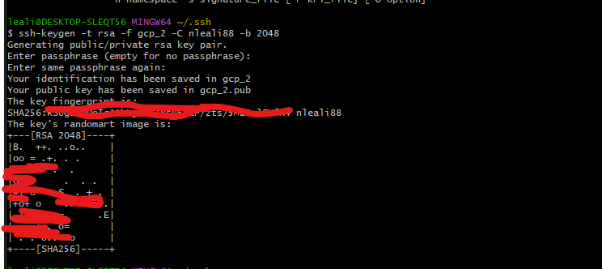
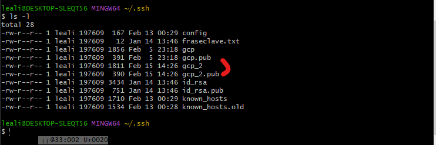
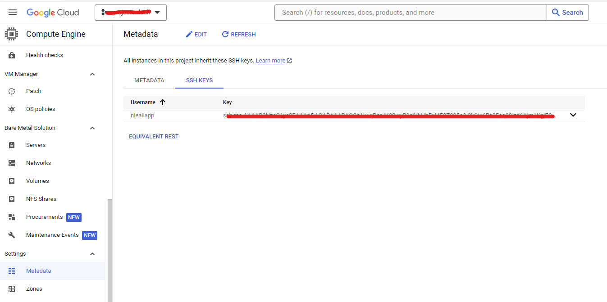
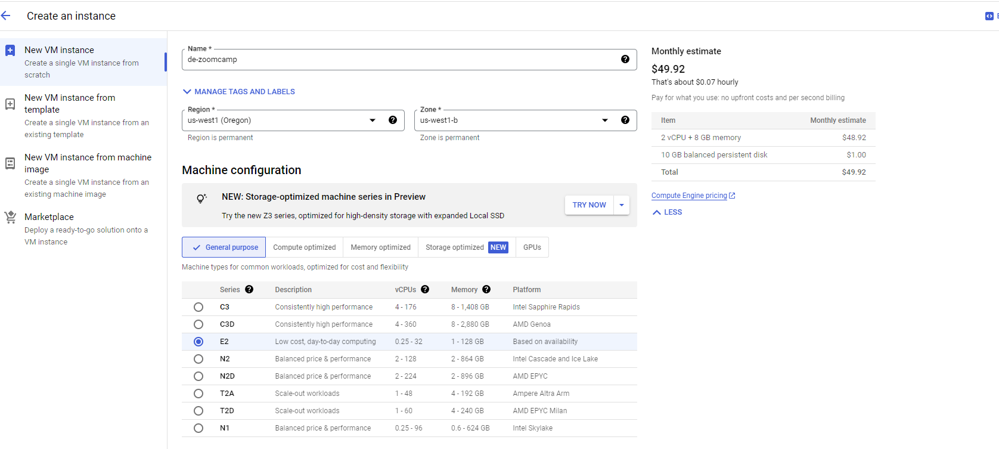
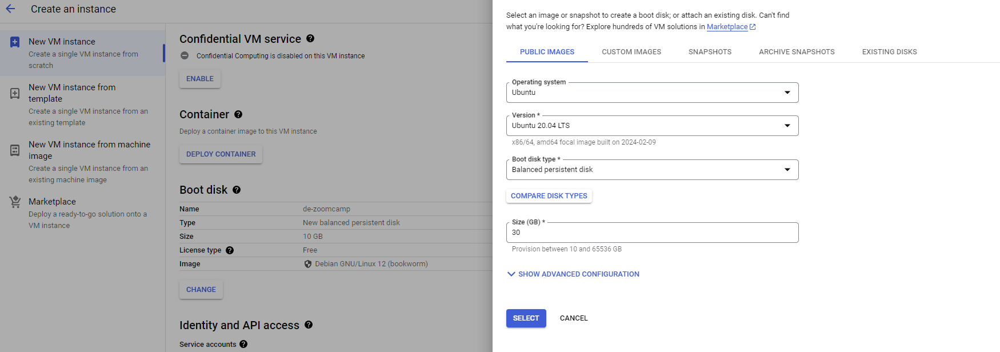
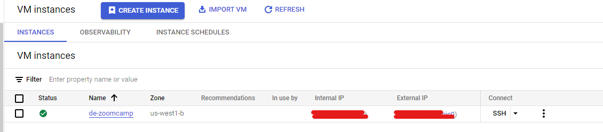
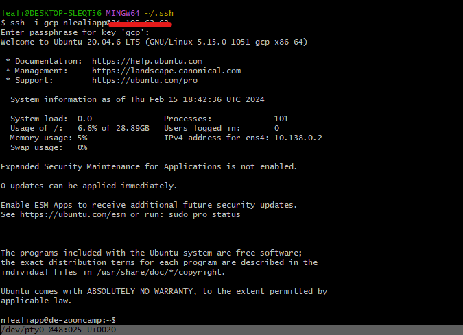
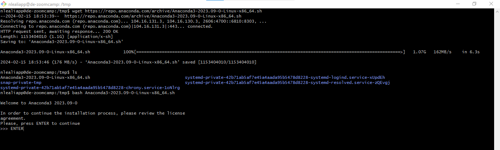

# Creación de un Entorno en GCP

1. [Introducción](#1.-introducción)
2. [Creación del entorno GCP](#2.-creacion-del-entorno-gcp)
    - [Creacion de VM](#.-creacion-de-vm)
    - [Cómo logearnos en VM?](#.-cómo-logearnos-en-vm?)
    - [Creacion de un config-conexion](#.-creacion-de-un-config-conexion)
    - [Instalacion de Anaconda](#.-instalacion-de-anaconda)
    - [Instalacion de Docker](#.-instalacon-de-docker)
    - [Instalar gcloud y gsutil](#.-gcloud-y-gsutil)
    - [Crear una sesión con permisos gcloud](#.-gcloud-y-gsutil)
    


## 1. Introducción

En este proyecto vamos a crear una máquina virtual para poder deployar Docker, Anaconda y Spark.

Primero es necesario crar una clave shh para poder conectarnos a los servicios de GCP.

[Creacion clave ssh Link](https://cloud.google.com/compute/docs/connect/create-ssh-keys?hl=es-419)

+ Nos logeamos en _git bash_ y escribimos situados en la carpeta .ssh (Si no existe lo creamos)

_gcp_ es el nombre que yo decido ponerle al .shh de google

```bash
 ssh-keygen -t rsa -f gcp_2 -C nlealiapp -b 2048
```



__No es necesario crear una frase__

Esto crea dos archivos:



+ gcp_2
+ gcp_2.pub

* Para poder logearnos en la VM que vayamos a crear, debemos cargar el archivo _gcp_2_ (o el que hayamos creado) en _metadata_ en la opcion __compute Engine__



_Solo podemos tener una ssh por VM_

```
generate ssh key

add it to metadata

HOST de-mio
    HotName: IP
    User nlealiapp
    IdentifyFile C:/users/leali/.ssh/gcp
```

## 2. Creacion del entorno GCP

Una vez creada la clave _.ssh_ y mapeada en __Cloud Computing Service__ podemos crear la VM.

### Creacion de VM

1. Hacemos click en _CREATE NEW INSTANCE_

2. Elegimos el nombre, en este caso __de-zoomcamp__



```
Según la combinación que CPU + Memoria el precio varia.
```
3. Elegimos el SO.



4. Con la Instancia creada, buscamos la _external IP_



Esta IP es la que nos permite conectarnos desde nuestra PC local a la VM, usando las credenciales _.ssh_

### Cómo logearnos en VM?

Abrimos una sesión de _gitbash_ y escribimos:

```shell
ssh -i ~/.ssh/gcp_2 nlealiapp@IP
```



Con esto ya estamos legeados dentro de la VM.

+ Escribimos __gcloud --version__  para ver la versión de los paquetes.


#### Comandos básicos dentro de la VM

- htop para ver uqe maquina tenemos
- gcloud --version 


### creacion de un config-conexion

```
Podemos crear un archivo config para no tener que escribir la conexion cada vez que queremos logearnos en la VM.
```

En la consola bash escribimos _touch config_

```shell
Host de-zoomcamp
    HostName IPpublica
    User nlealiapp
    IndentityFile c:/Users/mi_usuario/.ssh/gcp
```

Para conectarnos hacemos.

```shell
shh de-zoomcamp
```

Esto va a buscar directamente la conexión zoomcamp en el archivo _config_

### Instalacion de Anaconda.

[Link a anaconda para linux](https://repo.anaconda.com/archive/Anaconda3-2023.09-0-Linux-x86_64.sh)

En la consola de la VM hacemos.

```
wget https://repo.anaconda.com/archive/Anaconda3-2023.09-0-Linux-x86_64.sh
```

Lo escribimos en la VM y luego de la descarga instalamos anaconda.

```
bash Anaconda ...
```



Una vez descargado continuamos con la instalacion.


## En nuestro GITBASH LOCAL creamos un archivo config para configurar nuestro .ssh

```
Host de-zoomcamp
	HostName 34.134.173.41
	User nlealiapp
	IdentityFile gcp
```

IdentifyFile es la ruta del archivo, si vamos a crear config en .shh lo pondemos así, sino debemos poner la ruta completa.

__IMPORTANTE__ Vcode pide la ruta completa: ~/.ssh/gcp sinó no funciona.

### Ejecución.

```bash
shh de-zoomcamp
```


#### INstalamos Docker

```bash
sudo apt-get update
sudo apt-get install docker.io
```

#### VS

Instalamos la extencion remote ssh open folder on remote.

