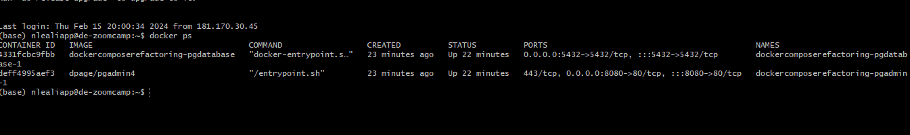
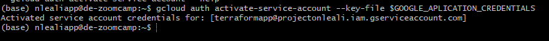

# Creación de un Entorno en GCP

1. [Introducción](#1.-introducción)
2. [Creación del entorno GCP](#2.-creacion-del-entorno-gcp)
    - [Creacion de VM](#.-creacion-de-vm)
    - [Cómo logearnos en VM?](#.-cómo-logearnos-en-vm?)
    - [Creacion de un config-conexion](#.-creacion-de-un-config-conexion)
    - [Conexion a VM con VSCODE](#.-conexion-a-vm-con-vscode)
    - [Instalacion de Anaconda](#.-instalacion-de-anaconda)
    - [Instalacion de Docker](#.-instalacion-de-docker)
    - [Instalacion de docker-compose](#.-instalacion-de-docker-compose)
3. [Ejecutar un contenedor de Docker-compose](#3.-ejecutar-un-contenedor-de-docker-compose)
4. [Como hacer port forward a nuestro equipo local](#4.-como-hacer-port-forward-a-nuestro-equipo-local)
    - [Como iniciar jupyter](#.-como-iniciar-jupyter)
5. [Prueba del entorno en general](#5.-prueba-del-entorno-general)
6. [Instalacion de Terraform](#6.-instalacion-de-terraform)
    - [Como pasar archivos locales al cloud por sftp](#.-como-pasar-archivos-locales-al-cloud-por-sftp)
    - [Instalar gcloud y gsutil](#.-gcloud-y-gsutil)
    - [Crear una sesión con permisos gcloud](#.-gcloud-y-gsutil)

    


## 1. Introducción

En este proyecto vamos a crear una máquina virtual para poder deployar Docker, Anaconda y Spark.

Primero es necesario crar una clave shh para poder conectarnos a los servicios de GCP.

[Creacion clave ssh Link](https://cloud.google.com/compute/docs/connect/create-ssh-keys?hl=es-419)

+ Nos logeamos en _git bash_ y escribimos situados en la carpeta .ssh (Si no existe lo creamos)

_gcp_ es el nombre que yo decido ponerle al .shh de google

```bash
 ssh-keygen -t rsa -f gcp_2 -C nlealiapp -b 2048
```


__No es necesario crear una frase__

Esto crea dos archivos:


+ gcp_2
+ gcp_2.pub

* Para poder logearnos en la VM que vayamos a crear, debemos cargar el archivo _gcp_2_ (o el que hayamos creado) en _metadata_ en la opcion __compute Engine__


_Solo podemos tener una ssh por VM_

```
generate ssh key

add it to metadata

HOST de-mio
    HotName: IP
    User nlealiapp
    IdentifyFile C:/users/leali/.ssh/gcp
```

## 2. Creacion del entorno GCP

Una vez creada la clave _.ssh_ y mapeada en __Cloud Computing Service__ podemos crear la VM.

### Creacion de VM

1. Hacemos click en _CREATE NEW INSTANCE_

2. Elegimos el nombre, en este caso __de-zoomcamp__


```
Según la combinación que CPU + Memoria el precio varia.
```
3. Elegimos el SO.


4. Con la Instancia creada, buscamos la _external IP_


Esta IP es la que nos permite conectarnos desde nuestra PC local a la VM, usando las credenciales _.ssh_

### Cómo logearnos en VM?

Abrimos una sesión de _gitbash_ y escribimos:

```shell
ssh -i ~/.ssh/gcp_2 nlealiapp@IP
```


Con esto ya estamos legeados dentro de la VM.

+ Escribimos __gcloud --version__  para ver la versión de los paquetes.


#### Comandos básicos dentro de la VM

- htop para ver uqe maquina tenemos
- gcloud --version 


### creacion de un config-conexion

```
Podemos crear un archivo config para no tener que escribir la conexion cada vez que queremos logearnos en la VM.
```

En la consola bash escribimos _touch config_

```shell
Host de-zoomcamp
    HostName IPpublica
    User nlealiapp
    IndentityFile c:/Users/mi_usuario/.ssh/gcp
```

Para conectarnos hacemos.

```shell
shh de-zoomcamp
```

Esto va a buscar directamente la conexión zoomcamp en el archivo _config_


### Conexion a VM con VSCODE

Para poder conectanos debemos tener instalada la extension __ssh remote conection__


Desde visual code buscamos la opción de conexión y hacemos click.


Esto busca en nuestro fichero .ssh algún archivo __config__ y nos muestra los _host_ disponibles.


Una vez elegido el Host, nos puede pedir nuestra frase, si es que creamos una. Luego abre otra ventana y nos muestras nuestra VM.


### Instalacion de Anaconda.

[Link a anaconda para linux](https://repo.anaconda.com/archive/Anaconda3-2023.09-0-Linux-x86_64.sh)

En la consola de la VM hacemos.

```
wget https://repo.anaconda.com/archive/Anaconda3-2023.09-0-Linux-x86_64.sh
```

Lo escribimos en la VM y luego de la descarga instalamos anaconda.

```
bash Anaconda ...
```


Una vez descargado continuamos con la instalacion.

Al finalizar la instalacion escribimos __yes__ y para ver lo que generó en la instalación hacemos.
_Anaconda_ se instala en la carpeta del usuario.


Escribimos el siguiente comando para ver si todo si instaló correctamente.

```shell
less .bashrc
```


Vemos que lo pultimo instalado es _Anaconda_

Tambien podemos escribir __which python__ y ver que se instaló dentro de anaconda.

### Instalacion de Docker

Docker no viene por defecto con Ubunto, lo tenemos que instalar desde la linea de comando de la VM.

```shell
sudo apt-get update
sudo apt-get install docker.io
```


_El problema con docker es que no podemos ejecutarlo con los permisos existentes_

```shell
(base) nlealiapp@de-zoomcamp:~$ docker run hello-world
docker: permission denied while trying to connect to the Docker daemon socket at unix:///var/run/docker.sock: Post "http://%2Fvar%2Frun%2Fdocker.sock/v1.24/containers/create": dial unix /var/run/docker.sock: connect: permission denied.
See 'docker run --help'.
```

Para solucionar esto usamos __run docker without sudo__

1. add the __docker__ group if it doesnt exist

```
sudo groupadd docker
```

2. Add the connected user $USER to docker group

```shell
sudo gpasswd -a $USER docker
```

3. Restart the _docker_ daemon

```shell
sudo service docker restart
```

4. Logout and Login

Ahora se puede ejecutar de prueba __docker hello-world__


### Instalacion de docker-compose

Para instalar Docker-Compose vamos al [GITHUB](https://github.com/docker/compose/releases)

Elegimos la version: __V2.2.3__ version Linux __docker-compose-linux-x86_64__

1. En la carpeta de usuario creamos un directorio bin

```
mkdir bin
cd bin
```

2. Descargamos docker-compose y especificamos el output __docker-compose__

```
wget https://github.com/docker/compose/releases/download/v2.24.6/docker-compose-linux-x86_64 -O docker-compose
```

3. Esto nos crea un archivo .sh pero Linux no sabe que es ejecutable, le cambiamos el modo.

```
chmod +x docker-compose
```

El color cambia a __verde__ indicando que es un ejecutable.


4. Probamos que funciona.

```
./docker-compose --version
```

5. No queremos hacer esto desde el __bin__ directorio de nuestro usuario. LO agregamos al PATH variable.

Para poder hacer esto debemos estar en el directorio de nuestro proyecto, __no es la nueva carpeta que creamos__

```
nano .bashrc
```

Al final del archivo escribimos:


```
export PATH="${HOME}/bin:${PATH}"
```


## 3. Ejecutar un contenedor de Docker-Compose

Tomamos como ejemplo el la imagen del repositorio

```
https://github.com/caece-nico/datatalksDataEng/tree/master
```

1. Copiamos el repositorio

git clone https://github.com/caece-nico/datatalksDataEng/tree/master


2. Ejecutamos docker-compose (desde el repositorio) para instalar pgadmin y postgres, directorio __DockerComposeRefactoring__

```
docker-compose up -d
```


Importante: __Puede ser que haya que cambiar el directorio de Postgres, de /Postgres a ./Postgres__

3. Comprobamos los servicios.

Hacemos __docker ps__ para ver lo que está corriendo y en que puerto.

4. Instalamos __pgcli__

Desde el directorio HOME

```
cd ~/
PIP install pgcli
pgcli --h localhost -U root -d ny_taxy
```

|parametro|descripcion|
|---------|-----------|
|h| HOST|
|U|USUARIO|
|d|Base de datos|


Vemos que se conectó aunque dió varios errores. __Una mejor opción es usar conda para instalarlo__

5. Primero lo desinstalamos.

```
pip uninstall pgcli
```

6. Instalamos usando __conda__

```shell
conda install -c conda-forge pgcli
pip install -U mycli
```

## 4. Como hacer port forward a nuestro equipo local

En la imagen  vemos los puertos que están utilizando _postgres_ y _pgadmin_

Nos podemos conectar a estos servicios desde nuestro equipo local exponiendo los puertos.

1. En VSCODE desde donde estamos logeados en nuestro cloud, vamos a __ports__

Especificamos el puerto de __postgres__ 5432.


Exponiendo el puerto nos pudimos conectar, por ejemplo desde __dbeaver__


__cuidado__ Si tenemos un contenedor de _DOCKER_ ejecutando un _postgres_ tambien en _localhost_ por defecto nos conectamos al local y __no__ al cloud.

2. Podemos hacer lo mismo con _pgadmin_

Exponemos el puerto 8080

### Como iniciar Jupyter

1. Ponemos en un bash

```
jupyter notebook
```


El resultado de esto son los puertos donde está corriendo

2. Hacemos forward de esos puertos en VSCODE puerto 8888

Y ahora entramos en la dirección que muestra el bash.

## 5. Prueba del entorno general

```
Vamos a probar que nuestro pipeline local funciona en la nube.```

1. bajamos el dataset 

```shell
wget https://github.com/DataTalksClub/nyc-tlc-data/releases/download/yellow/yellow_tripdata_2021-01.csv.gz
```

2. De ser necesario instalamos unzip o gunzip

```shell
sudo apt install unzip
```

3. Descomprimimos el dataset.

```shell
unzip yellow_tripdata_2021-01.csv.gz
gunzip yellow_tripdata_2021-01.csv.gz
```

4. Creamos la notebook

La notebook de este ejemplo la encontramos en /DockerComposeRefactoring


5. Cuando importamos sqlalchemy puede ser que no funcione la libreria __psycopg2__ la instalamos haciendo __conda install psycopg2__

6. Siempre recordar poner los puertos forwarding.


## 6. Instalacion de terraform

```
Vamos a instalar Terraform en la VM para poder crear y manipular los recursos necesarios para el proyecto.
```
1. Descargar Terraform a la carpeta __/bin__


2. Desde una consola bash hacemos

```shell
wget https://releases.hashicorp.com/terraform/1.7.3/terraform_1.7.3_linux_amd64.zip
```

3. Una vez dscargado hacemos un _unzip_ del archivo, siempre en el directorio /bin que creamos nosotros en una carpeta de usuario

```shell
unzip terraform_1.7.3_linux_amd64.zip
```

Vemos que el archivo resultante ya es un ejecutable.


### Como pasar archivos locales al cloud por sftp

Si hicimos los pasos anteriores para instalar Terraform lo único que falta es pasar los archivos con las credenciales a la VM.
Estas credenciales se crean como cuenta de servicio. Para mas datos consultar [link a tutorial de Terraform](https://github.com/caece-nico/datatalksDataEng/tree/master/Week-1/GCP_Terraform)

1. Verificar que descargamos el .json con la clave de Google Service Account


Vemos que las credenciales entán en __mi equipo local__

2. Abrimos una conexion por __sftp__ a nuestro ssh

```shell
sftp de-zommcamp
```

3. Creamos una carpeta donde copiar el archivo en la VM

```
mkdir .gc
cd .gc
```

4. Copiamos el archivo desde la misma terminal.

```
put mis_crdenciales.json 
```


5. Creamos una variable que apunte a nustras credenciales.

```shell
export GOOGLE_APLICATION_CREDENTIALS=~/.gc/mis_credenciales.json
```

6. Usamos __bash__ para autenticar nuestro __google cli__

```shell
gcloud auth activate-service-account --key-file $GOOGLE_APLICATION_CREDENTIALS
```



Vemos que la cuenta quedó activada.

7. Creamos los recursos de Terraform usando la nueva autenticacion sin pasar un __file(mis_credenciales.json)__ en el __main.tf__

