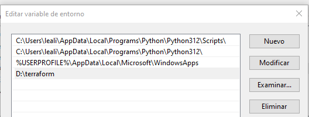
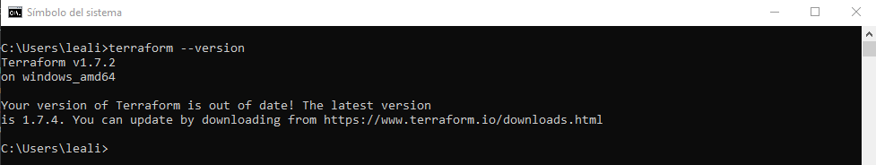
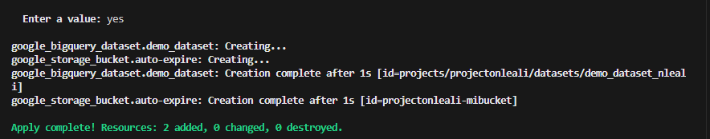
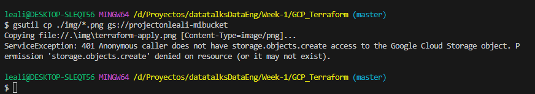
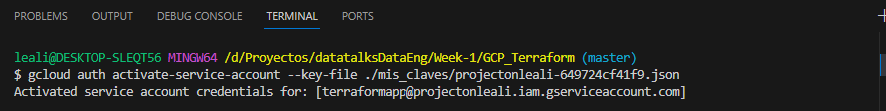
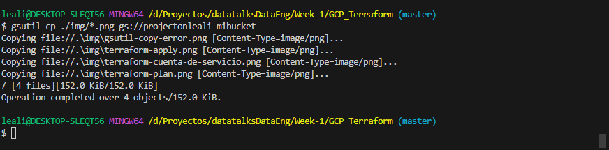

# Google Cloud Y Terraform

1. [Introducción a terraform](#1.-introduccion-a-terraform)
  - [Instalacion](#.-instalacion)
2. [Introducción a GCP](#2.-introduccion-a-gcp)
    - [Creacion d una cuenta de servicio](#.-creacion-de-una-cuenta-de-servicio)
3. [Crear script terraform](#.-crear-script-terraform)
    - [init](#.-init)
    - [plan](#.-plan)
    - [apply](#.-apply)
    - [destroy](#.-destroy)
4.  [Crear sesion en GCLOUD](#4.-crear-sesion-en-gcloud)
    - [utilidad GSUTIL](#.-utilidad-gsutil)  
5.  [Usar variables en Terraform](#5.-Usar-variables-en-terraform)


## 1. Introducción a Terraform

```
Nos permite hacer un setup de infraestructura como código usando human-readable configuration files.
Es simple y nos permite hacer un seguimiento de la infraestructura.
Es reproducible en varios equipos, pruede ser en entornos de desarrollo y test o producción.
Nos permite asegurarnos que los recursos son eliminados una vez que terminamos de usarlos.
```

* No está hecho para modificar codigó en infraestructura.
* No permite modifcar recursos que son inmutables.
* No se puede hacer referencia a recursos que no están especificados en el file terraform.

**PROVIDERS**

Es codigo que permite a Terraform conectarse y deployar sobre los servidores de la nube.
Estos providers se obtienen una vez que ejecutamos el comando 

```shell
terraform main.tf
```

## Instalacion

Para instalar Terraform en Windows primero debemos descargar la version X64 del sitio web de descargas.

[Link al sitio de descargas](https://developer.hashicorp.com/terraform/install)

Una vez descargado lo descomprimimos en el disco D:\terraform.

Creamos una variable Global de sistema PATH que apunte a ese directorio:



Comprobamos la instalacion

Abrimos una terminal y escribimos:

```
terraform --version
```




# 2. Introduccion a GCP.

Antes de crear el archivo _terraform_ es necesarios crear una _cuenta de servicios_ para indicarle a GCP quienes somos y que recursos queremos acceder, modificar o crear.

## Creacion de una cuenta de servicio

_service account_ es una cuenta para software, pero que no vamos a usar como usuarios finales. Sirve para crear buckets u otros recursos.


Le otorgamos permisos de edit sobre

+ Big Data
+ Storage Database
+ Compute Engine

```
Si necesitamos agregar un permiso no lo hacemos desde la pantalla de service account, lo hacemos desde IAM y editamos el usuario de servicio.
```

## Tipos de cuenta en GCP

1. Service acount -> es un tipo de cuenta que solo deberia ser acedida por software
2. User Account -> es una cuenta para usuarios con privilegios.


__Generamos la clave como JSON y la guadardamos en un lugar seguro__


# 3. Crear script Terraform

Una vez creada la cuenta de servicio y descargada la clave _json_ podemos crear el archivo _.tf_ con las especificaciones de nuestra infraestructura.


## Comandos claves

|command|descripción|
|-------|-----------|
|init|Get all the providers I need|
|plan|what am I about to do?|
|apply|Do what is in the _tf_ files|
|destroy|Remove everything defined in the tf files|


## Creacion de un archivo Terraform para Google Provider

Buscamos en google un modelo de __provider de terraform para google y le empezamos a añadir servicios__


```python

terraform {
  required_providers {
    google = {
      source  = "hashicorp/google"
      version = "5.6.0"
    }
  }

provider "google" {
  credentials = file("misCredenciales.json")
  project     = var.project
  region      = "us-central1"
}
```

Desde la consola un comando que nos puede ayudar a que todo se vea mejor es :

```
terraform fmt
```

debemos estar en la carpeta del main.tf

## Ejecución de terraform

1. Primero debemos instalarlo. Es un archivo ejecutable, lo descargamos en una carpeta y creamos una variabe de sistema.
2. En este ejemplo no está funcionando desde gitbash asique lo hacemos desde __cmd__ situados en el directorio del main.tf

```shell
tarraform init
```

Despues de ejecutar este comando crea los archivos neecsarios de terraform, no borrarlos.

__Este comando baja los providers necesarios__

```
Initializing the backend...

Initializing provider plugins...
- Finding hashicorp/google versions matching "5.6.0"...
- Installing hashicorp/google v5.6.0...
- Installed hashicorp/google v5.6.0 (signed by HashiCorp)

Terraform has created a lock file .terraform.lock.hcl to record the provider
selections it made above. Include this file in your version control repository
so that Terraform can guarantee to make the same selections by default when
you run "terraform init" in the future.

Terraform has been successfully initialized!

You may now begin working with Terraform. Try running "terraform plan" to see
any changes that are required for your infrastructure. All Terraform commands
should now work.

If you ever set or change modules or backend configuration for Terraform,
rerun this command to reinitialize your working directory. If you forget, other
commands will detect it and remind you to do so if necessary.
```

### Creacion de un Bucket en GCP

- para saber como crear un Bucket lo buscamos en Intener (Google)
- El nombre de un bucket debe ser único, podemos unir  el nombre del proyecto + Bucket.

```python
resource "google_storage_bucket" "auto-expire" {
  name          = "auto-expiring-bucket"
  location      = "US"
  force_destroy = true


  lifecycle_rule {
    condition {
      age = 1
    }
    action {
      type = "AbortIncompleteMultipartUpload"
    }
  }
}
```

* age -> está en dias

+ ¿Qué es Terraform plan?

Es un plan de ejecución que muestra lo que va a hacer y el orden.
Se ejecuta desde la consola sobre el directorio que está el __main.tr__


```
terraform plan
```


Muestra lo que va a hacer el proceso que creamos. Es un _blueprint_

### Ejecutamos terraform

Este comando materializa la infraestructura definida en el código.

```
terraform apply
```

```
google_storage_bucket.auto-expire: Creating...
google_storage_bucket.auto-expire: Creation complete after 2s [id=proyectoaatatalk-mi_primer_bucket]

Apply complete! Resources: 1 added, 0 changed, 0 destroyed.
```

__IMPORTANTE__ tuvimos que ejecutar el archivo con un nuevo usuario con permisos de edit.



### Destruimos el todo lo que creamos.

Cuando ejecutamos __apply__ se crea un archivo de estados con información de lo que ejecutó _terreform_ __terraform.tfstate__
Para hacer el __DESTROY__ LLAMA A ESTE ARCHIVO y consulta lo que debe eliminar.

```
terraform destroy
```
```
google_storage_bucket.auto-expire: Destroying... [id=proyectoaatatalk-mi_primer_bucket]
google_storage_bucket.auto-expire: Destruction complete after 3s

Destroy complete! Resources: 1 destroyed.
```

### Creacion de un Dataset  - BigQuery

```python
resource "google_bigquery_dataset" "demo_dataset" {
  dataset_id = "demo_dataset"
}
```

En este ejemplo creamos n _bucket_ y un _bigquery_

```
google_bigquery_dataset.demo_dataset: Creating...
google_storage_bucket.auto-expire: Creating...
google_bigquery_dataset.demo_dataset: Creation complete after 2s [id=projects/projectonleali/datasets/demo_dataset]
google_storage_bucket.auto-expire: Creation complete after 2s [id=proyectoaatatalk-mi_primer_bucket]

```


## 4. Crear sesion en GCLOUD

```
Si necesitamos usar algunos de los recursos creados desde nuestra PC local, necesitamos crear una sesion de cuenta de servicios para que pueda acceder al bucker y subir algpun archivo.
```

Para esto usar _GCLOUD_ para crear la sesión y _GSUTIL_ para acceder a los recursos.

__IMPORTANTE__ Para acceder a estos recursos vamos a usar las credenciales qeu corresponden a la _sesion de servicios_ el mismo .json usado para dar de alta los recursos de _terraform_

### Copiamos sin los permisos necesarios.



En este ejemplo vemos que si no damos antes la autorizacion sobre _usuario de servicios_ no podemos copiar.

```shell
gsutil cp ./img/*.png gs://projectonleali-mibucket
```

### Otorgamos los permisos necesarios.



Una vez otorgados los permisos los mismos son activados.

```shell
gcloud auth activate-service-account --key-file ./mis_claves/projectonleali-649724cf41f9.json
```
Activated service account credentials for: [terraformapp@projectonleali.iam.gserviceaccount.com]

### Volvemos a copiar con los permisos necesarios.



## 5. Usar variables en terraform

Para poder usar variables en _terraform_ necesitamos crear un nuevo archivo llamado _variables.tf_.
Este archivo contendrá por cada parámetro que querramos extender el siguiente formato.

+ Archivo variable.tf

```python
variable "gcs_bucket_name" {
  description = "Nombre del bucket"
  default     = "projectonleali-mibucket"
}
```

Donde _variable_ es el nombre de la variable que vamos a usar en el archivo _main.tf_ y _default_ será el valor que contendrá esa variable.

+ Archivo _main.tf_

```python
resource "google_storage_bucket" "auto-expire" {
  name          = var.gcs_bucket_name
  location      = var.location
  force_destroy = true
```

En este ejemplo usamos dos variables:
1. __gcs_bucket_name__
2. __location__

ambas son llamadas con __var__