# Cómo conectar Spark con GoogleCloud

1. [Introducción](##1.-Introduccion)
    - [Permisos cuenta de servicio](#.-permisos-cuenta-de-servicio)
2. [Creacion de una ssh para ubuntu](#2.-creacion-ssh-ubuntu)


## 1. Introduccion

En este proyecto vamos a ver como conectar Spark con el entorno de GoogleCloud.
Para esto, vamos a volver a crear nuestros Buckets en GoogleVloud usando terraform, con la cuenta de servicio que ya teniamos.

### Creamos el entorno con Terraform

[Tutorial para instalar terraform](https://techcommunity.microsoft.com/t5/azure-developer-community-blog/configuring-terraform-on-windows-10-linux-sub-system/ba-p/393845)

### paso 1 .

Antes de instalar terraform en wsl barimos una nueva terminal de Ubuntu e instalamos:

```shell
sudo apt-get update
sudo apt-get upgrade
```

SI es necesario instalamos __unzip__

```shell
sudo apt-get install unzip
```

### paso 2 .

Abrimos __VSCODE__ e instalamos la extension necesaria de Terraform.

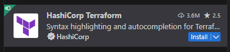


### paso 3.

Vamos a la pagina de Terraform Descargas y escribimos:

```shell
wget <terraform_url> -O terraform.zip;
unzip terraform.zip;
sudo mv terraform /usr/local/bin;
rm terraform.zip;
```

buscamos la version amd64

```
https://releases.hashicorp.com/terraform/1.7.3/terraform_1.7.3_linux_amd64.zip
```

### paso 4.

Ejecutamos el comando __terraform -v__ para verificar que terraform está instalado ok.

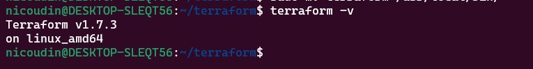

### PAso 5.

Para poder continuar necesitamos tener los permisos necesarios sobre el cloud usando las credenciales de la __cuenta de servicio__.
El el archivo .json que descargamos desde GCLOUD.

1. Descargamos el archivo y lo guardamos en una carpeta _./gc__

2. Vinculamos la credencial con una variable global:

```shell
export GOOGLE_APLICATION_CREDENTIALS=~/.gc/mis_credenciales.json
```

3. Activamos el entorno.

```shell
gcloud auth activate-service-account --key-file $GOOGLE_APLICATION_CREDENTIALS
```

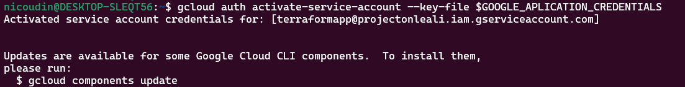

__IMPORTANTE__ Esto puede no funcionar desde el WSL, de ser así usar _gitbash_ o poner la localización del archivo .json en terraform

4. Ejecución de terraform.

```shell
terraform init
```

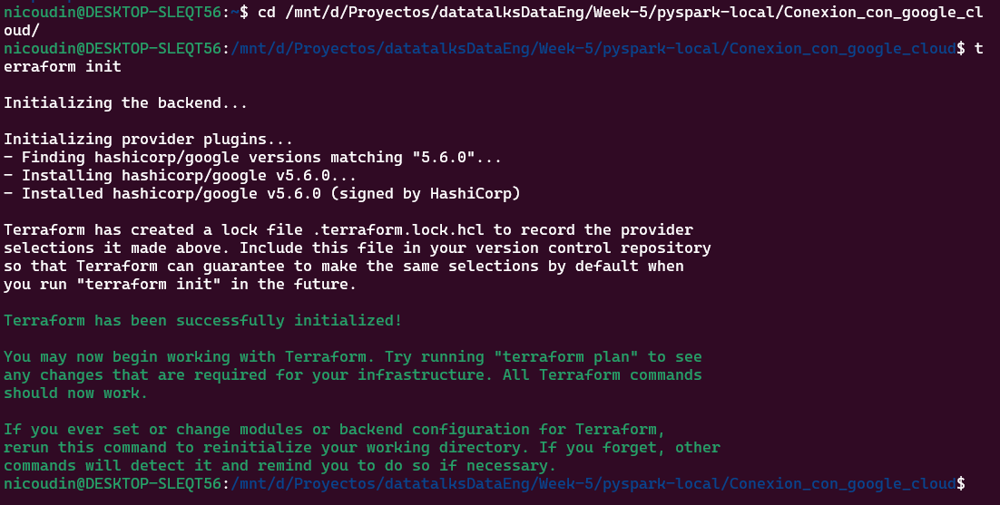

```shell
terraform plan
```

Acá es donde pueden fallar los permisos, de ser así especificar el archivo de las credenciales de GOGGLE.

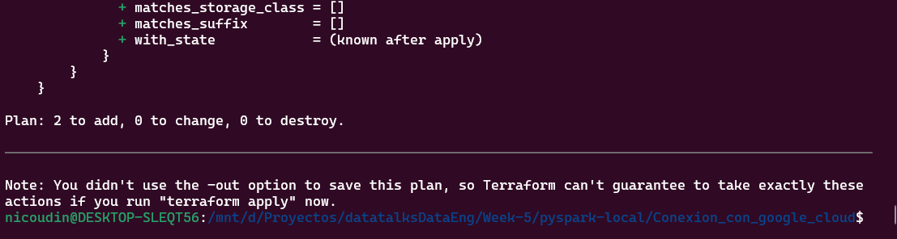

```shell
terraform apply
```

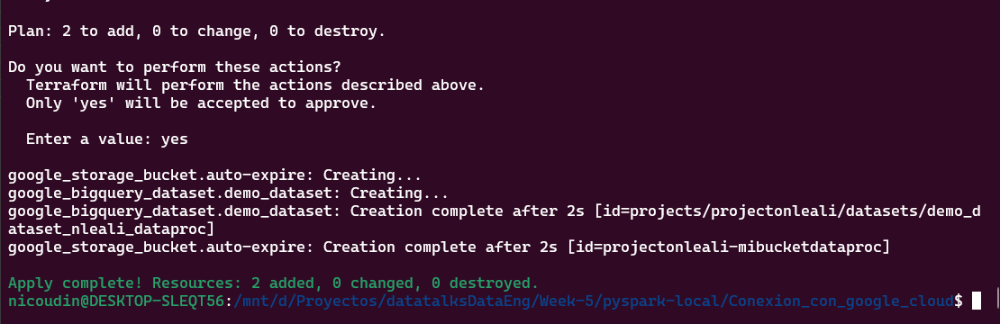

```
Con todos los recursos creados podemos probar que los permisos del cloud funcionan. POdemos intentar subir un archivo al nuevo bucket:
gs://projectonleali-mibucketdataproc
```

```shell
gsutil cp -r readme.md gs://projectonleali-mibucketdataproc 
```

## Permisos cuenta de servicio

```
Es importante saber que una vez que se otorgan los permisos a un entorno los mismos quedan hasta que sean revocados explicitamente desde la gcloud API.
Si no hay permisos para la cuenta de servicios no podremos interactuar con Google Cloud
```

1. Listamos todos los permisos que existen en nuestro entorno.


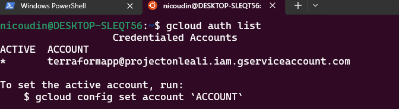

EN este caso hay un permisos pero si no hubiera ninguno y queremos subir un archivo al bucket recibiriamos un mensaje como el siguiente:

```
gsutil cp -r terraform/ gs://projectonleali-mibucketdataproc
```

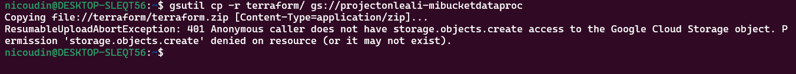

2. Otorgamos los permisos necesarios y reintentamos subir un archivo.

```
gcloud auth activate-service-account --key-file $GOOGLE_APLICATION_CREDENTIALS
```
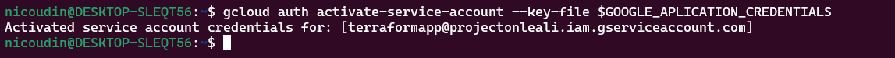

Subimos una carpeta o archivo al bucket

```
gsutil cp -r terraform/ gs://projectonleali-mibucketdataproc
```


3. Para revocar un permisos hacemos

```
gcloud auth revoke [cuenta de servicio]
```

## 2. Creacion ssh Ubuntu

Desde una terminal escribimos los comandos. (le ponemos de nombre gcp)

1. Creamos una carpeta en el __/home/usuario/.shh__

```shell
sudo shh-keygen -t rsa -f gcp -C nlealiapp -b 2048
```

__No es necesario que tenga una passphrase__

Por defecto se guarda en /root/.shh

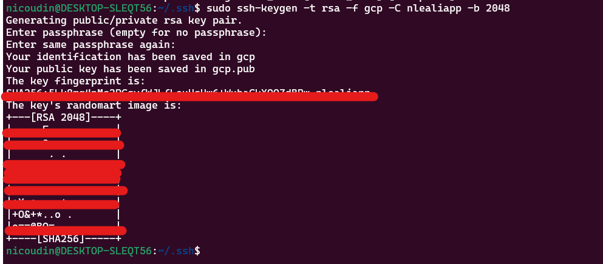

2. UNa vez creada la nueva .ssh con el nombre gcp_ubuntu (Notar que le cambiamos el nombre) debemos crear una nueva metadata en VM de GCLOUD y copiar el contenido de gcp_ubuntu.pub en el campo de la clave.

3. Nos logeamos desde ubuntu

```
shh -i gcp_ubuntu nlealiapp@IP
```

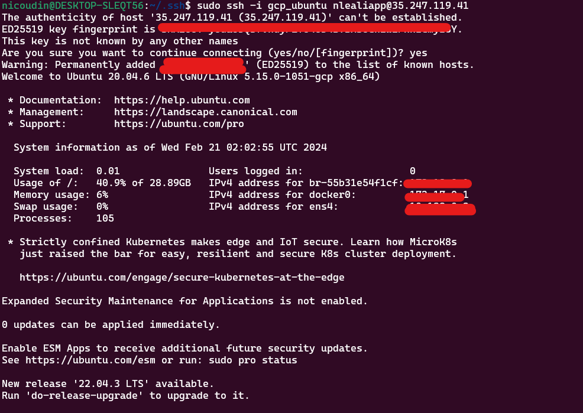

4. Una vez logeados, hacemos lo mismo que en git bash. Creamos un archivo config en .shh para logearnos solo con un __name__

```shell
cd .ssh
touch config
```

En el archivo __config__ 

```
Host de-zoomcamp_ubuntu
	HostName 35.247.119.41
	IdentityFile ~/.ssh/gcp_ubuntu
	User nlealiapp
```

__En ubuntu da error__ averiguar el motivo