# Cómo conectar Spark con GoogleCloud

1. [Introducción](##1.-Introduccion)
    - [Permisos cuenta de servicio](#.-permisos-cuenta-de-servicio)
2. [Creacion de una ssh para ubuntu](#2.-creacion-ssh-ubuntu)
3. [Spark-Entorno Local](#3.-spark-entorno-local)
	- [Posibles error](#.-posibles-errores)


## 1. Introduccion

En este proyecto vamos a ver como conectar Spark con el entorno de GoogleCloud.
Para esto, vamos a volver a crear nuestros Buckets en GoogleVloud usando terraform, con la cuenta de servicio que ya teniamos.

### Creamos el entorno con Terraform

[Tutorial para instalar terraform](https://techcommunity.microsoft.com/t5/azure-developer-community-blog/configuring-terraform-on-windows-10-linux-sub-system/ba-p/393845)

### paso 1 .

Antes de instalar terraform en wsl barimos una nueva terminal de Ubuntu e instalamos:

```shell
sudo apt-get update
sudo apt-get upgrade
```

SI es necesario instalamos __unzip__

```shell
sudo apt-get install unzip
```

### paso 2 .

Abrimos __VSCODE__ e instalamos la extension necesaria de Terraform.

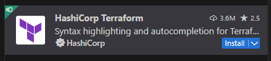


### paso 3.

Vamos a la pagina de Terraform Descargas y escribimos:

```shell
wget <terraform_url> -O terraform.zip;
unzip terraform.zip;
sudo mv terraform /usr/local/bin;
rm terraform.zip;
```

buscamos la version amd64

```
https://releases.hashicorp.com/terraform/1.7.3/terraform_1.7.3_linux_amd64.zip
```

### paso 4.

Ejecutamos el comando __terraform -v__ para verificar que terraform está instalado ok.

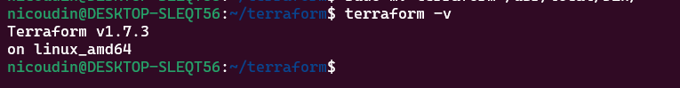

### PAso 5.

Para poder continuar necesitamos tener los permisos necesarios sobre el cloud usando las credenciales de la __cuenta de servicio__.
El el archivo .json que descargamos desde GCLOUD.

1. Descargamos el archivo y lo guardamos en una carpeta _./gc__

2. Vinculamos la credencial con una variable global:

```shell
export GOOGLE_APLICATION_CREDENTIALS=~/.gc/mis_credenciales.json
```

3. Activamos el entorno.

```shell
gcloud auth activate-service-account --key-file $GOOGLE_APLICATION_CREDENTIALS
```

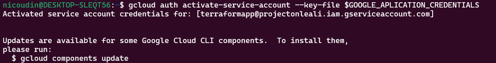

__IMPORTANTE__ Esto puede no funcionar desde el WSL, de ser así usar _gitbash_ o poner la localización del archivo .json en terraform

4. Ejecución de terraform.

```shell
terraform init
```

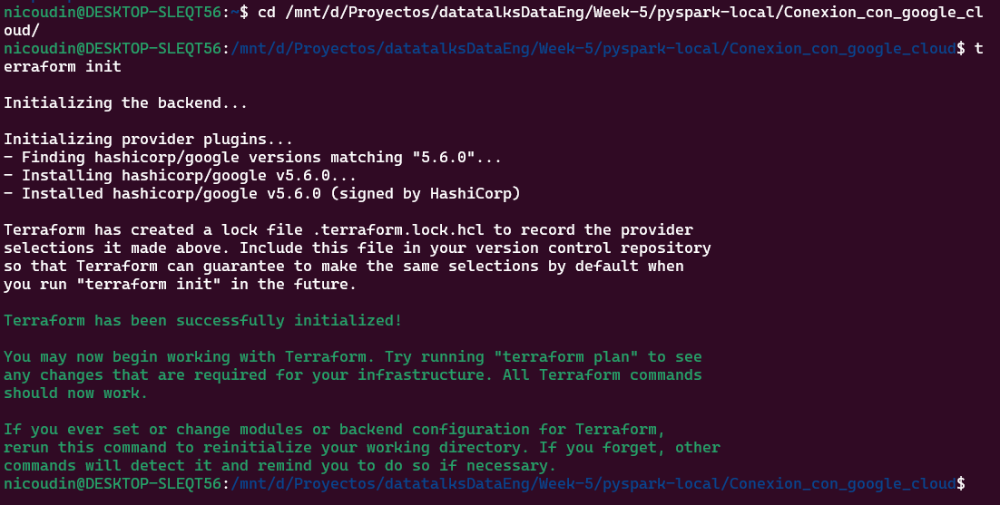

```shell
terraform plan
```

Acá es donde pueden fallar los permisos, de ser así especificar el archivo de las credenciales de GOGGLE.

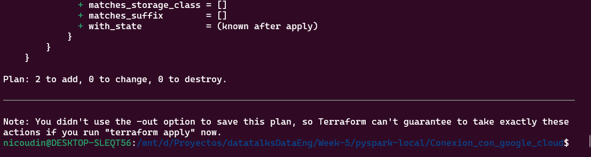

```shell
terraform apply
```

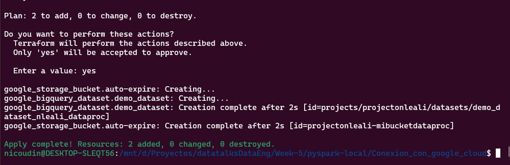

```
Con todos los recursos creados podemos probar que los permisos del cloud funcionan. POdemos intentar subir un archivo al nuevo bucket:
gs://projectonleali-mibucketdataproc
```

```shell
gsutil cp -r readme.md gs://projectonleali-mibucketdataproc 
```

## Permisos cuenta de servicio

```
Es importante saber que una vez que se otorgan los permisos a un entorno los mismos quedan hasta que sean revocados explicitamente desde la gcloud API.
Si no hay permisos para la cuenta de servicios no podremos interactuar con Google Cloud
```

1. Listamos todos los permisos que existen en nuestro entorno.


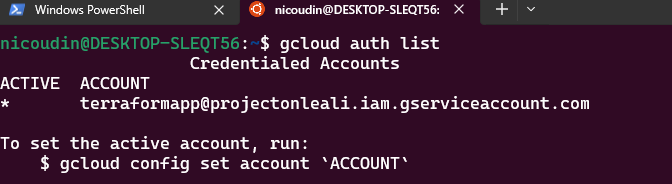

EN este caso hay un permisos pero si no hubiera ninguno y queremos subir un archivo al bucket recibiriamos un mensaje como el siguiente:

```
gsutil cp -r terraform/ gs://projectonleali-mibucketdataproc
```

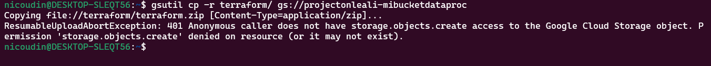

2. Otorgamos los permisos necesarios y reintentamos subir un archivo.

```
gcloud auth activate-service-account --key-file $GOOGLE_APLICATION_CREDENTIALS
```
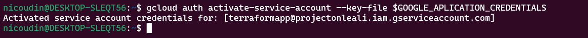

Subimos una carpeta o archivo al bucket

```
gsutil cp -r terraform/ gs://projectonleali-mibucketdataproc
```

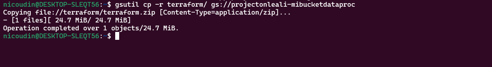


3. Para revocar un permisos hacemos

```
gcloud auth revoke [cuenta de servicio]
```

## 2. Creacion ssh Ubuntu

Desde una terminal escribimos los comandos. (le ponemos de nombre gcp)

1. Creamos una carpeta en el __/home/usuario/.shh__

```shell
sudo shh-keygen -t rsa -f gcp -C nlealiapp -b 2048
```

__No es necesario que tenga una passphrase__

Por defecto se guarda en /root/.shh

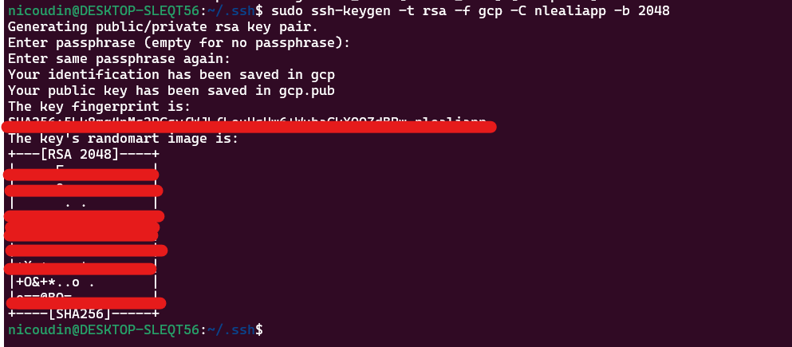

2. UNa vez creada la nueva .ssh con el nombre gcp_ubuntu (Notar que le cambiamos el nombre) debemos crear una nueva metadata en VM de GCLOUD y copiar el contenido de gcp_ubuntu.pub en el campo de la clave.

3. Nos logeamos desde ubuntu

```
sudo shh -i gcp_ubuntu nlealiapp@IP
```

__Siempre usamos sudo, sino es posible que no nos podamos conectar__

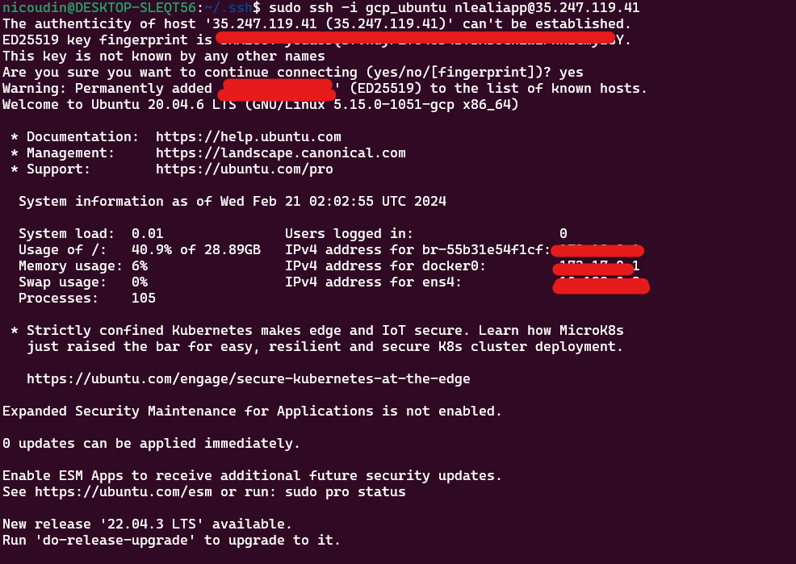

4. Una vez logeados, hacemos lo mismo que en git bash. Creamos un archivo config en .shh para logearnos solo con un __name__

```shell
cd .ssh
touch config
```

En el archivo __config__ 

```
Host de-zoomcamp_ubuntu
	HostName 35.247.119.41
	IdentityFile ~/.ssh/gcp_ubuntu
	User nlealiapp
```

__En ubuntu da error__ averiguar el motivo


## 3. Spark entorno local

```
Con las claves ssh creadas y la cuenta de servicio activa en WSL (UBUNTU) vamos a trabajar con nuestro entorno de Spark local para acceder a GoogleCloud
Luego, mas adelante, intalaremos Spark en la VM de GoogleCloud.
```

Para conectarnos a GCLOUD Bucket necesitamos:
+ .json con las credenciales de la cuenta de servicios.
+ .jar con la nueva version de Hadoop3 para GCLOUD

1. Copiamos un archivo de pruebas al bucket de google para intentar conectarnos desde spark(wsl) a GoogleCloud Storage

Primero del repo local al nuevo que creamos para este proyecto(optativo)


```shell
cp /mnt/d/Proyectos/datatalksDataEng/Week-5/pyspark-local/Trabajo_de_la_semana/data/raw/green/2020/01/* /mnt/d/Proyectos/datatalksDataEng/Week-5/pyspark-local/Conexion_con_google_cloud/datos/green/2020/01/
```

ahora copiamos a la nube.

```shell
 gsutil cp -r green/2020/01/* gs://projectonleali-mibucketdataproc/data/green/2020/01/
```

2. Intentamos conectarnos con spark al google bucket usando __gs://__

Ejemplo de lectura con error

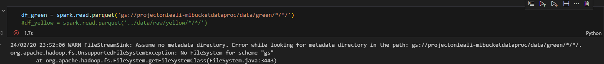

Est da un error porque para que spark se pueda conectar al stora de Google necesita un __.jar__ y crear un __context__.

3. Instalacion de los __.jars__

### Punto 1.

Descargamos el conector de hadoop 3x para google cloud storage

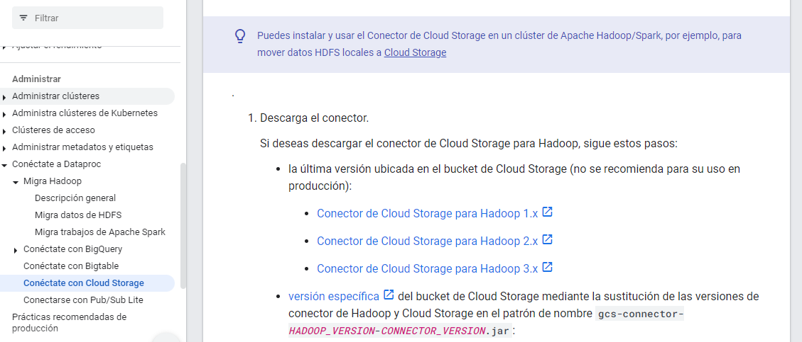

[link conector hadoop 3.x GCP](https://cloud.google.com/dataproc/docs/concepts/connectors/cloud-storage?hl=es-419)

En el directorio raiz __~/__ creamos la carpeta Lib donde vamos a descargar esta libreria. Tambien vamos a copiar el jar en el directorio jar de la instalacion de Spark.

```shell
ls -l lib
ls -l spark/spark-3.3.2-bin-hadoop3/jars/gc*
```

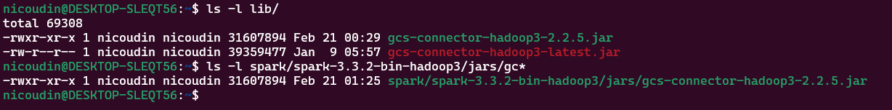


La credenciales las guardamos en ${HOME}/.gc/projectonleali-649724cf41f9.json

4. Creamos una sesion de Spark

```
Para poder usar este jar la creación de la sesión es un poco mas compleja porque debemos indicarle a Spark donde está el JAR que necesita para conectarse.
```

#### 4.1 Importamos las librerias necesarias.

```python

import pyspark
from pyspark.sql import SparkSession
from pyspark.conf import SparkConf
from pyspark.context import SparkContext
```

#### 4.2 Especificamos donde está el .jar y las credenciales de la cuenta de servicios.

```python
credentials_location = '/home/nicoudin/.gc/projectonleali-649724cf41f9.json'

conf = SparkConf() \
    .setMaster('local[*]') \
    .setAppName('otross') \
    .set("spark.jars", "/home/nicoudin/spark/spark-3.3.2-bin-hadoop3/jars/gcs-connecto-hadoop3-2.2.5.jar") \
    .set("spark.hadoop.google.cloud.auth.service.account.enable", "true") \
    .set("spark.hadoop.google.cloud.auth.service.account.json.keyfile", credentials_location)
```

#### 4.3 Creamos un Contexto de Spark con la configuración del paso 4.2

```python
sc = SparkContext.getOrCreate(conf=conf)

hadoop_conf = sc._jsc.hadoopConfiguration()

hadoop_conf.set("fs.AbstractFileSystem.gs.impl",  "com.google.cloud.hadoop.fs.gcs.GoogleHadoopFS")
hadoop_conf.set("fs.gs.impl", "com.google.cloud.hadoop.fs.gcs.GoogleHadoopFileSystem")
hadoop_conf.set("fs.gs.auth.service.account.json.keyfile", credentials_location)
hadoop_conf.set("fs.gs.auth.service.account.enable", "true")
```

#### 4.4 Creamos la sesion de Spark

```python
spark = SparkSession.builder\
    .config(conf=sc.getConf()) \
        .getOrCreate()
```

#### 4.5 Leemos un archivo de GSCLOUD

```python
df_green = spark.read.parquet("gs://projectonleali-mibucketdataproc/data/green/2020/01/green_2020_01.parquet")
```

Si tenemos que detener la sesión de Spark para hacer un cambio en la configuración, escribimos:

```python
spark.stop()
```


### Posibles Errores

```
Cuando estaba desarrollando está solución me encontré con el error:
```

Caused by: java.lang.ClassNotFoundException: Class com.google.cloud.hadoop.fs.gcs.GoogleHadoopFileSystem not found

No estoy seguro como lo solucioné pero está relacionado con el __.jar__ que descargamos de Hadoop3x

```
La solución fué, copiar el .jar en el directorio de jars de la instalacion de Spark y apuntar a ese directorio la variable de JARS.
.set("spark.jars", "/home/nicoudin/spark/spark-3.3.2-bin-hadoop3/jars/gcs-connecto-hadoop3-2.2.5.jar")
```

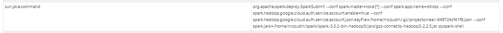

Una vez que creamos la sesión de Spark y se habilita el puerto 4040, en la opción __environments__ vemos las variables uqe seteamos.

Si esto no funciona, probar copiar el .jar al directorio donde está el código que estamos ejecutando.