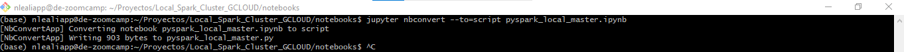

# Creacion de un Cluster de Spark en GCLOUD

1. [Introduccion](#1.-introduccion)
2. [Creacion-de-un-Master](#2.-creacion-de-un-master)
    - [Instancias el nuevo master](#.-instanciar-nuevo-master)
    - [Lectura de un archivo de prueba](#.-lectura-de-un-archivo-de-prueba)
3. [Creacion/Inicio de Worker](#3.-creacion/inicio-de-worker)
4. [Subit a Cluster Master](#4.-submit-a-cluster-master)
5. [Mejoras al script](#5.-mejoras-al-script)
    - [Parametrizar entrada de archivos](#.-parametrizar-entrada-de-archivos)
    - [Parametrizar Cluster/mMster](#.-parametrizar-cluster-master)
6. [Como usar DataProcs](#6.-como-usar-dataprocs)


## 1. Introduccion

Vamos a crear un Cluster de Spark en nuestro entorno Cloud. A pesar que es una VM de Google, lo consideramos __local__.

[Trabajamos con este tutorial](https://spark.apache.org/docs/latest/spark-standalone.html)

Para poder crear  _un cluster de Spark_ primero debemos iniciar eL __master__ y luego los __nodos workers__. Con esto podremos __subir__ uno o varios __job__ al master para ser ejecutado por los workers.


## 2. Creacion de un Master

Para poder crear un Nodo Master primero debemos asegurarnos que no esté ejecutando Spark en el entorno Local y luego desde la terminal escribimos.

```shell
./sbin/start-master.sh
```
Esto se ejecuta desde la instalacion de __~/Spark/ spark-3.3.2-bin-hadoop3__


Para poder visualizar este _master_ debemos hacer forward de un puerto, por defecto es el 8080.


Una vez expuestos los puertos podemos entrar al __localhost:8080__ y ver la instancia que fupe creada.


### Instanciar nuevo Master

Despues de haber creado el master y obtener un dirección similar a: __Spark Master at spark://de-zoomcamp.us-west4-b.c.projectonleali.internal:7077__,  reemplazamos .master("local[+]") por esta dirección en la notebook.

```python
spark = SparKSession.builder\
    .master("spark://de-zoomcamp.us-west4-b.c.projectonleali.internal:7077")\
        appName('TestMaster')\
            .getOrCreate()
```

Una vez iniciado __spark__ debemos ver algo así.


__Si con la dirección URL no funciona, probar con localhost:7077 o 127.0.0.1:7077__


### Lectura de un archivo de prueba

```
Con el Master inicializado vamos a intentar leer un .parquet de la carpeta /data
gsutil cp -r  gs://projectonleali-mibucketdataproc/data/ /home/nlealiapp/Proyectos/Local_Spark_Cluster_GCLOUD/data/
```

```python
mi_parquet = spark.read.parquet("../data/*/*)
```

Esto deberia dar el siguiente error:

__24/02/23 14:22:00 WARN TaskSchedulerImpl: Initial job has not accepted any resources; check your cluster UI to ensure that workers are registered and have sufficient resources
24/02/23 14:22:15 WARN TaskSchedulerImpl: Initial job has not accepted any resources; check your cluster UI to ensure that workers are registered and have sufficient resources__

el motivo es que __solo tenemos un master y necesitamos un worker para que tome la tarea__


Vista desde __localhost:8080__ donde se ve __0 workers y una tarea en pendiente__


## 3. Creacion/Inicio de Worker

Desde una terminal, en el entorno local de la nube, ejecutamos el siguiente comando:

```shell
./sbin/start-slave.sh spark://de-zoomcamp.us-west4-b.c.projectonleali.internal:7077
```

__puede ser que tengamos una version nueva de SPARK y el comando sea ./sbin/start-worker.sh URL__


Una vez ejecutado el comando deberiamos ver


y el __localhost:8080__


## 4. Submit a Cluster Master

### Primero 

Convertimos la notebook a un script de Python usando el comando:

```
jupyter nbconvert --to=script pyspark_local_master.ipynb
sudo mv  pyspark_local_master.py ../code/pyspark_local_master.py
```

Convertimos a .py y lo movemos a la carpeta __code__



### Segundo

Vamos a ejecutar el script __pyspark_local_master.py__ desde el Bash usando python.
Cuando lo hacemos vemos que la nueva ejecución no tiene recursos disponibles porque la aplicación anterior tomó todos los recursos.


Para solucionar esto vamos a hacer un __kill__ de la aplicacion anterior.


Despues de hacer el __kill__ vemos que se retoma la actividad de la aplicación actual.


En el __localhost:8080__ vemos que la aplicacion terminó ok.


## 5. Mejoras al Script

### Parametrizar entrada de archivos

```
El script que tenemos es un poco rígido. Vamos a agregarle parametria para poder seleccionar el año o periodo a analizar y tambien el Master/Cluster que querramos usar.
```

### Primero

Agregamos parametros con la libreria __argparse__ para que tome el archivo origen y el destino.

```python
import argparse

parser = argparse.ArgumentParser()

parser.add_argument('--input_data', required=True)
parser.add_argument('--output_data', required=True)

args = parser.parse_args()

input_data = args.input_data
output_data = args.output_data
```

Forma de ejecución por __bash/shell__ es

```python 
python pyspark_local_master_parametrizado.py \
    --input_data=../data/data/green/2020/* \
    --output_data=../data/reportes_param/
```

__IMPORTANTE__ notar que para indicar la ruta del directorio de __data__ usamos ".." porque está un nivel superior.


### Parametrizar Cluster/Master

```
Puede darse el caso que querramos elegir con que ejecutor trabajar, cuantos workers o la cantidad de GB de RAM neecsitamos para cada uno.
Lo ideal es no especificra esto en el archivo .py sino por medio de parametros.
```

#### Paso Uno

Debemos sacar __master.()__ del archivo .py y vamos a usar __spark-submit.sh__ para indicar el cluster a utilizar.

```shell
URL=""
./sbin/spark-submit.sh \
--master="${URL}" \
archivo.py \
--parametro1= <> \
--parametro2= <> \
```

Caso real.

```shell
URL="spark://de-zoomcamp.us-west4-b.c.projectonleali.internal:7077"
spark-submit --master="${URL}" \
pyspark_local_master_parametrizado_con_submit.py \
--input_data=../data/data/green/2020/* \
--output_data=../data/reportes/parametrizado/master/
```

Esto lo debemos ejecutar desde el directorio donde tenemos el __code__.

El resultado es similar a este:


```
Para ejecutar este .py es importante notar que no especificamos el .master() sino que toma el mismo de la parametrizacion al momento de la ejecución.
```

__IMPORTANTE__ Recordar detener primero los _workers_ y luego el _master_

```
./sbin/stop-worker.sh
./sbin/stop-master.sh
```
# 6. Como usar DataProcs.

La primera vez que usamos _dataprocs_ nos pide habilitar la API.


Luego nos habilita la opción para crear un cluster.


__IMPORTANTE__ al momento de crear un cluster de _dataproc_ debemos tener en cuenta que la region debe ser la misma que la del bucket que vayamos a usar.
Si es _multiregion_ elegir cualquiera de USA. 

Una vez acyivada la API puee ser que tarde en activar. Hay que esperar, sinó vemos un mensaje como el siguiente.

```
Service Account '728428137411-compute@developer.gserviceaccount.com' not found.
```

#### Creacion del cluster DataProcs.

Elegimos el nombre y la region. Intentar que sea igual a la region de los Buckets.


Con esto seleccionado, elegimos los componentes __Docker__ y __Jupyter__ y creamos.

