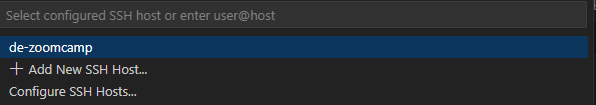

# Tutorial para Ejecutar PySpark en la Nube.

1. [Introducción](#1.-Introduccion)
2. [Instalacion de pyspark](#2.-instalacion-de-pyspark)
3. [Crear notebook y exponer puertos](#3.-crear-notebook-y-exponer-puertos)


## 1. Introduccion

```
En este tutorial vamos a ver como Isstalr y  ejecutar Spark en la Nube, seria la continuación del tutorial de la semana 1 (Week-1) para crear un entorno CLOUD.
Vamos a usar la VM que creamos en la Week-1, y vamos a seguir los pasos de la instalación de PyPsark de WSL-Ubuntu pero en VM.
Luego vamos a volver a ejecutar el proyecto de la notebook "Conexion_wsl_con_google_cloud" pero ahora directamente en la VM teniendo en cuenta las mismas consideraciones que teniamos en WSL-Ubuntu.
```

## 2. Instalacion de PySpark

### Paso 2.1 Logearnos en VM CLOUD

Desde Ubuntu hacemos:

```shell
sudo ssh -i gcp_ubuntu nlealiapp@35.247.119.41
```


### Paso 2.2 Comprobar la version de GCLOUD y los permisos de la cuenta de servicio

```shell
gcloud auth list
gcloud --version
```


### Paso 2.3 Comprobar lo que está instalado en el HOME

```shell
ls -l ~/
```


```
En el directorio bin tenemos terraform y docker-compose (Instalados en la week-1)
```

### Paso 2.4 instalamos Spark

#### Paso 2.4.1 Descarga de JDK 11.0.1

Instalamos Java JDK.

[Instaladores de JDK](https://jdk.java.net/archive/)

La version de Java a utilizar es la __11.0.1__ de Linux

[Link al download directo](https://download.java.net/java/GA/jdk11/13/GPL/openjdk-11.0.1_linux-x64_bin.tar.gz)

```
Creamos un directorio ~/spark donde vamos a descargar e instalar todo
wget https://download.java.net/java/GA/jdk11/13/GPL/openjdk-11.0.1_linux-x64_bin.tar.gz
tar xzvf openjdk-11.0.1_linux-x64_bin.tar.gz
rm openjdk-11.0.1_linux-x64_bin.tar.gz
```

__IMPORTANTE__ notar que la primera vez lo hicimos mal, creamos el directorio __spark__ dentro de bin (MAL), debe ir en el HOME


#### Paso 2.4.2 Seteamos las variables de JAVA.

```
En el directorio HOME abrimos .bashrc y seteamos las siguientes variables apuntando a /home/nlealiapp/spark
```

```shell
export JAVA_HOME="${HOME}/spark/jdk-11.0.1"
export PATH="${JAVA_HOME}/bin:${PATH}"
```

__IMPORTANTE__ Siempre despues de modificar el .bashrc recordar de hacer source .bashrc

Ejecutar los comandos para ver que todo esté OK

```shell
which java
java --version
```


#### Paso 2.4.3 Descragamos e instalamos Spark

__IMPORTANTE__ Originalmente instalamos la version 3.0.2 pero no funcionó bien. Las imagenes pueden no coincidir con las versiones.

```
Para este paso descargamos la version de Spark 3.3.2 con Hadoop3 en el directorio Spark
```

[Link de las descargas](https://archive.apache.org/dist/spark/)


```shell
wget https://archive.apache.org/dist/spark/spark-3.3.2/spark-3.3.2-bin-hadoop3.tgz
tar xzvf spark-3.3.2-bin-hadoop3.tgz
rm spark-3.3.2-bin-hadoop3.tgz
```


#### Paso 2.4.4 Seteamos las variables de Spark

En el archivo .bashrc en ~/ seteamos las variables globales de Spark

```shell
export SPARK_HOME="${HOME}/spark/spark-3.3.2-bin-hadoop3"
export PATH="${SPARK_HOME}/bin:${PATH}
```

__IMPORTANTE__ Siempre hacer source .bashrc despues  de modificar el archivo

Para probar __Spark__ hacemos 

```
spark-shell
```


#### Paso 2.4.5 Instalamos PySpark

Por defecto Spark instala hacia que directorio apunta Python, pero necesitamos setear una variable para que reconozca la libreria __py4j-0.10.9.5-src.zip__ que se encuentra en __~/spark/spark-3.3.2-bin-hadoop3/python/lib__

__Esto lo hacemos para poder importar pyspark desde una notebook_

Abrimos un nano .bashrc y seteamos

```shell
export PYTHONPATH="${SPARK_HOME}/python/:$PYTHONPATH"
export PYTHONPATH="${SPARK_HOME}/python/lib/py4j-0.10.9.5-src.zip:$PYTHONPATH"
```


## 3. Crear notebook y exponer puertos

Para trabar con el entorno de la Nube creamos una carpeta en el directorio __~/__ que se llame notebooks y ejecutamos __jupyter notebook__

```shell
mkdir notebook
jupyter notebook
```


### Paso 3.1 VSCODE - Login

Luego de ejecutar la __jupyter notebook__ en la VM  abrimos VSCODE y nos conectamos al __host__ usando las credenciales de .json



Sabemos que estamos conectados cuando vemos esto:


Y a continuacion elegimos el directorio donde queremos pararnos.

### Paso 2.3 VSCODE - Exponer puertos

Para exponer un puerto de una aplicacion de VM CLOUD desde VSCODE vamos a __ports__ y ponemos el puerto de la app a la que queremos acceder desde nuestro __entorno local__


Copiamos la direccion de jupyter en el explorador y deberiamos ver:


Tambien podemos usar __VSCODE__

Probamos que pyspark funciona correctamente.

```python
from  pyspark.sql import SparkSession

pyspark.__version__
pyspark.__file__

spark = SparkSession.builder\
    .master("local[*]")\
        .appName('Test01')\
            .getOrCreate()


```

Bajamos algunos datos de Taxis.

```shell
!mkdir data
wget https://d37ci6vzurychx.cloudfront.net/trip-data/yellow_tripdata_2022-01.parquet -P data/
```

```python
df = spark.read\
    .parquet("./data/yellow_tripdata_2022-01.parquet")
df.show(5)
```


