# Creación de un entorno Virtual Local con PySpark

1. [Instalacion del entorno virtual - miniconda](#1.-instalacion-del-entorno-virtual)
    - [Tutorial rapido de miniconda](#.-tutorial-rapido-de-miniconda)
    - [Como desactivar el entorno](#.-como-desactivar-el-entorno)
2. [Instalacion Spark DataZoomCamp en ubuntu/wsl](#2.-instalacion-spark-datazoomcamp-en-ubuntu/wsl)
  - [Conexion de VSCODE a WSL](#.-conexion-de-vscode-a-wsl)
5. [Otros recursos para instalar Spark](#5.-otros-recursos-para-instalar-spark)

## 1. Instalacion del entorno virtual

```
En este tutorial vamos a instalar PySpark en un entorno virtual de Python para hacer pruebas locales antes de pasar a la nube.
Para crear este entorno virtual necsitamos tener instalado ANACONDA.
```

1. Creamos el entorno virtual

En __conda-prompt__ escribimos:

```
conda env list
conda create -n pyspark-env
```

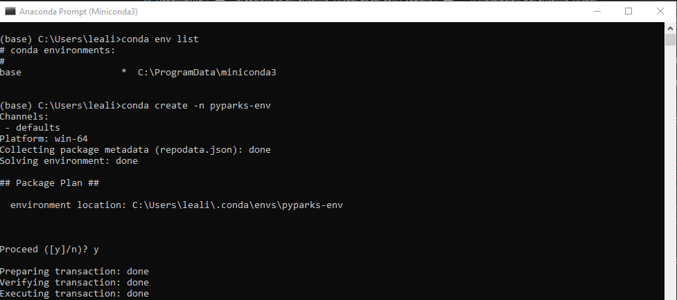

2. Activacion del entorno virtual

```
conda activate pysaprk-env
```

Deberia mostrar este resultado: 

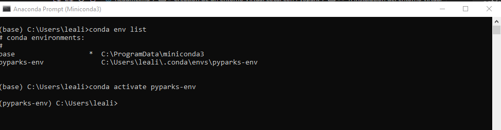


3. Ingresamos al entorno pyspark-venv 

```
code .
```

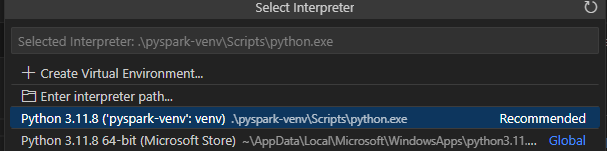

4. Instalacion de PySpark en conda

```
conda install pyspark
```

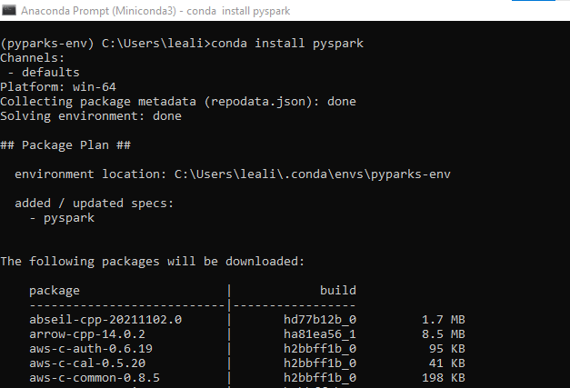


5. Creación de un Kernel para Pyspark-Jupyter

```
Para que PySpark sea visible por Jupyter Notebook es necesario crear un Kernel.
```

[Link para crear de un kernel de Jupyter](https://www.youtube.com/watch?v=KCo59BnKxkk)

```
jupyter kernelspec list
```

Para instalar el kernel hacemos

```
python -m ipykernel install --user --name=pyspark-env
```

Ahora volviendo a ejecutar el script 1 deberiamos ver el kernel de __jupyter__

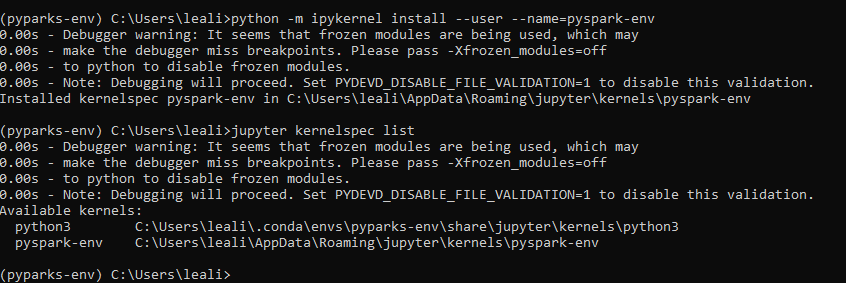

6. Logearnos a jupyter Lab

```
La version de miniconda no viene con jupyterlab por defecto, se la debemos instalar a nuestro entorno vritual.
```

```
conda install jupyterlab
```

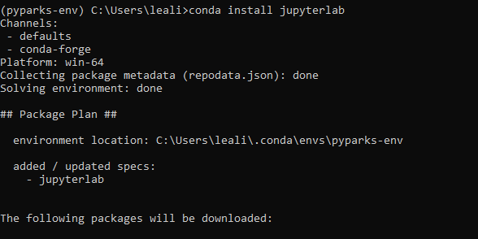

Al abrir jupyer lab desde la consola vemos el entorno creado.

```
jupyter lab
```

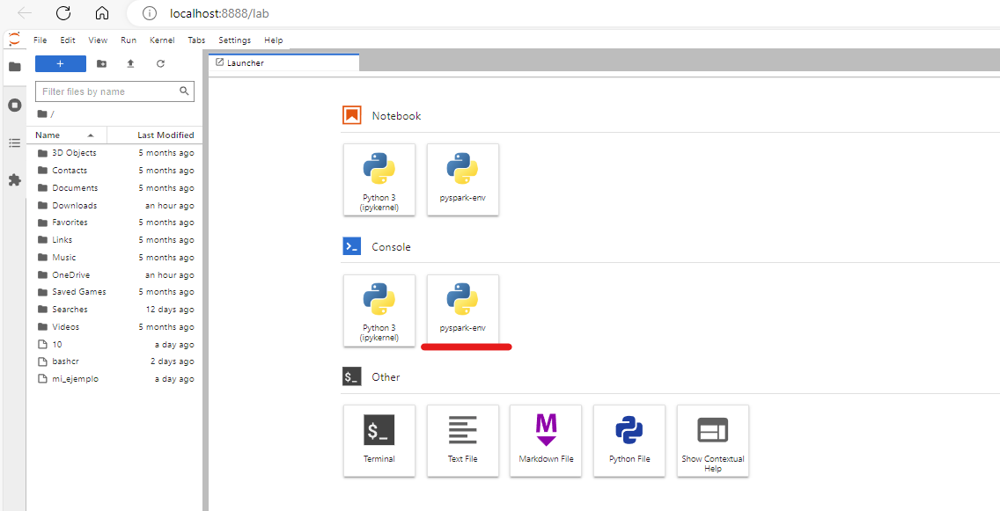


## Tutorial rapido de miniconda

[Link al tutorial de MINICONDA](https://conda.io/projects/conda/en/latest/user-guide/getting-started.html)


## Como desactivar el entorno

```
conda deactivate pyspark-env
```

## 2. Instalacion Spark DataZoomCamp en ubuntu/wsl

```
Lo mejor es instalar Spark en una distro de Linux sobre Windows y evitamos tener que crear e instalar Hadoop en el entorno Local.
Para esto debemos tener instalados WSL/Ubuntu y la terminal.
```

### Primer paso - Descarga de JDK.

* Creamos una carpeta __~/spark__ en el directorio __root__

Ejecutamos el comando

```shell
wget https://download.java.net/java/GA/jdk11/9/GPL/openjdk-11.0.2_linux-x64_bin.tar.gz
```
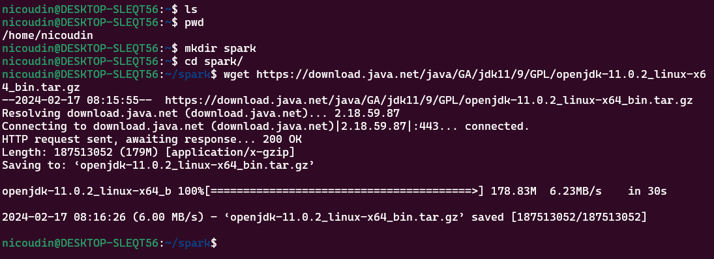

Extraemos (Unpack)

```shell
tar xzfv openjdk-11.0.2_linux-x64_bin.tar.gz
```

En el archivo ~/.bashrc, al final, copiamos estos paths (Siempre debemos estar en el HOME ~/)

```shell
export JAVA_HOME="${HOME}/spark/jdk-11.0.2"
export PATH="${JAVA_HOME}/bin:${PATH}"
```
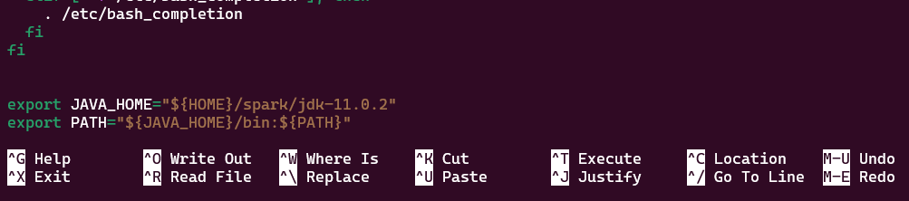

__IMPORTANTE__ hacemos source .bashrc y comprobamos la version de java

```shell
source .bashrc
java --version
```

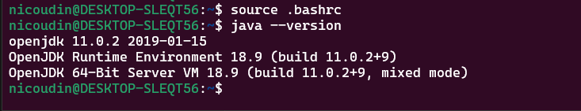

```shell
rm -r openjdk-11.0.2_linux-x64_bin.tar.gz
```


### Segundo paso - Instalacion Spark

```
Una vez instalado JDK instalamos Spark version 3.3.2
```

Ejecutamos el comando:

```shell
wget https://archive.apache.org/dist/spark/spark-3.3.2/spark-3.3.2-bin-hadoop3.tgz
```

Lo descomprimimos

```shell
tar xzfv spark-3.3.2/spark-3.3.2-bin-hadoop3.tgz
```

En el archivos ~/.bashrc copiamos al final los siguientes paths


```shell
cd ~/
nano .bashrc
export SPARK_HOME="${HOME}/spark/spark-3.3.2-bin-hadoop3"
export PATH="${SPARK_HOME}/bin:${PATH}"
```

__IMPORTANTE__ hacemos source .bashrc y comprobamos spark

Testeamos que spark funciona correctamente.

```shell
spark-shell
```
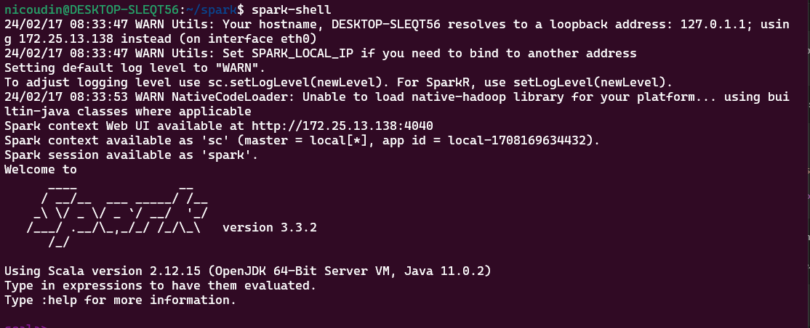

Ejecutamos los comandos 

```scala
val data = 1 to 10000
val distData = sc.parallelize(data)
distData.filter(_ < 10).collect()
```

```shell
rm -r spark-3.3.2/spark-3.3.2-bin-hadoop3.tgz
```
### Tercer paso  - Instalacion de PySpark

Para poder ejecutar PySpark primero debemos apuntar un PATH a Python

__IMPORTANTE__ PAra que este path funcione correctamente debemos tener en cuenta la version del __py4j__ sinó dará error: _ModuleNotFoundError: No module named 'py4j' while executing import pyspark_

Buscamos la version correcta de __py4j__

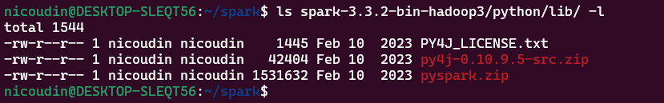

Copiamos los paths en .bashrc y le hacemos source .bashrc

```shell
nano .bashrc
export PYTHONPATH="${SPARK_HOME}/python/:$PYTHONPATH"
export PYTHONPATH="${SPARK_HOME}/python/lib/py4j-0.10.9.5-src.zip:$PYTHONPATH"
```

Para probarlo vamos al directorio ~/tmp
y descargamos el arhcivo

```shell
cd /tmp
wget https://s3.amazonaws.com/nyc-tlc/misc/taxi+_zone_lookup.csv
```

En este mismo directorio creamos una app Python con el codigo y lo ejecutamos


```python
import pyspark
from pyspark.sql import SparkSession

spark = SparkSession.builder \
    .master("local[*]") \
    .appName('test') \
    .getOrCreate()

df = spark.read \
    .option("header", "true") \
    .csv('taxi+_zone_lookup.csv')

df.show()

df.write.parquet('zones')

```

```shell
python3 app.py
```

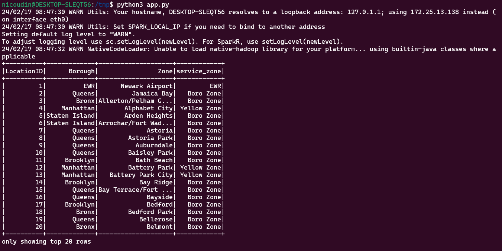

## Conexion de VSCODE a WSl

Para usar el __PySpark__ que instalamos en WSL/Ubuntu desde windows vamos a conectar VSCODE a la terminal como hacemos con las VM de google Cloud.

### Primero.

 Vamos al directorio donde tenemos nuestro proyecto desde wsl y ejecutamos vscode.

```shell
cd /mnt/d/Proyectos/datatalksDataEng/Week-5/pyspark-local/
```

__importante__ Recursod e como manejar de forma eficiente el storage entre wsl y windows.
[link storage](https://docs.microsoft.com/windows/wsl/setup/environment#file-storage)

La primera vez que ingresamos puede ser qu nos pida agregar algunas extenciones necesarias de Python.

### Segundo.

Comprobar que estamos usando la VM o instancia de Ubuntu.

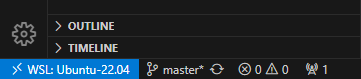

Esto nos asegura que usamos Python y Spark de WSL/Ubuntu y no de Windows.

### Ejecutamos el script

Para esta prueba local modificamos el script de python del ejemplo y ponemos que el archivo parquet se genere en el mismo directorio /tmp

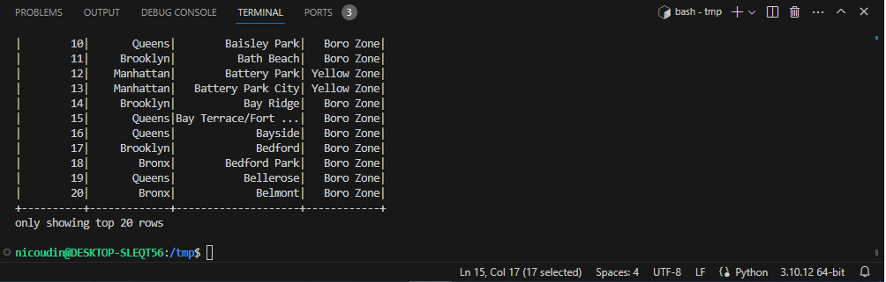

Durante la ejecución nos indica que la ejecución está usando un puerto 4040, lo podemos mapear para ver la actividad desde el browser.


## 5. Otros recursos para instalar Spark

1. [Link para instalar Spark en Anaconda](https://sparkbyexamples.com/pyspark/install-pyspark-in-anaconda-jupyter-notebook/)
2. [Link para instalar Spark en Windows](https://sparkbyexamples.com/pyspark/how-to-install-and-run-pyspark-on-windows/)