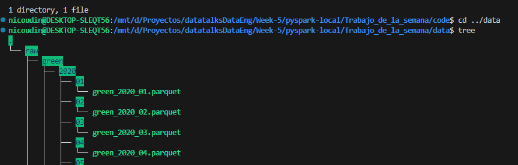

# Introducción al TP de la Semana.

1. [Origen de los datos](#1.-origen-de-los-datos)
    - [Modificacion propuesta](#.-modificacion-propuesta)


# 1. Origen de los datos

El origen de los datos es el sitio 

[NEW YORK DATA](https://www.nyc.gov/)

Los datasets se pueden encontrar en:

[LINK DATASETS](https://www.nyc.gov/)

donde todos tiene la misma estructura de URL:

```
https://d37ci6vzurychx.cloudfront.net/trip-data/yellow_tripdata_2020-01.parquet
```

+ TIPO_TAXI
+ ANIO
+ MES

Para descargar estos datasets usamos un script .bash __/code/download.sh__

## Como se ejecuta este script?

Desde la linea de comando hacemos

```shell
./download_data.sh yellow 2021
./download_data.sh green 2021
./download_data.sh yellow 2020
./download_data.sh green 2020
```

Para poder visualizar mejor la estructura de los archivos podemos instalar tree

```shell
sudo apt-get install tree
```



## Modificacion propuesta

Para hacer mas real este proyecto, no vamos a trabajar con los archivos __.parquet__ del punto 1.
Lo que hacemos es volver a cargarlos en .csv y guardarlos en un drive y simular que les debemos crear un nuevo esquema y luego pasarlos a __.parquet__