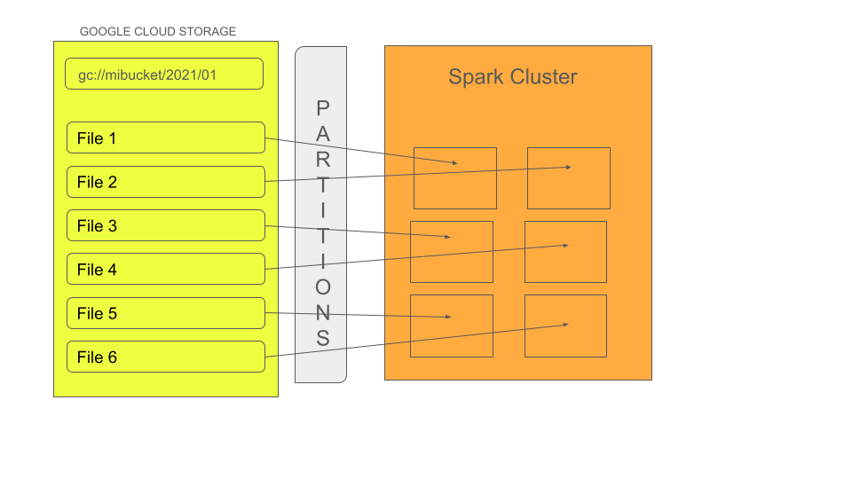

# Tutorial Batch Processing

1. [Introducción a Batch Processing](#1.-Introduccion-a-batch-processing)
2. [Intro a Apache Spark](#2.-introduccion-a-apache-spark)
    - [INstalar jupyter Notebooks](#.-instalar-jupyter-notebooks)
3. [Data de ejemplo](#3.-datos-de-ejemplo)
    - [pyspark](#.-pyspark)
    - [pandas](#.-pandas)
    - [Shell/Bash](#.-shell/bash)
    - [Formato Parquet](#.-formato-parquet)


## 1. Introduccion a Batch Processing

```
Hay dos formas de procesamiento de datos.
1. Batch
2. Streaming
```

El procesamiento _batch_ se refiere a procesar grandes cantidades de datos _chuncks_ de una vez.
Por otro lado el procesamiento _streaming_ procesa menos cantidades de datos pero de forma continua, consumiendo _eventos_ que son generados por un _publicador_ hacia un _consumidor_

Un proceso Batch generalemnte procesa datos con distinta granularidad. Las más comunes son Diaria, Semanal o por cada n horas.


|Tecnologias mas usadas.|
|-----------------------|
|Python Scripts|
|SQL|
|Spark|
|Flink|

Estos procesos pueden ejecutarse sobre distintas plataformas como _kubernetes_, _aws_ y son orquestados con _airflow_

```
Una ventaja del proceso Batch es que se le puede pedir al motor de orquestación repetir un batch si ocurre un suceso. Esto no es posible en Streaming.
```

Una desventaja es el Delay o el tiempo de ejecución entre Batch.


## 2. Introduccion a Apache Spark

```
Spark es un Motor de procesamiento distribuido en varios clusters (Data Processing Engine)
```

El principal uso de Spark es _Batch Jobs_ pero tambien se puede usar para _Streaming_.

Normalmente usamos Spark cuando nuestra data está en un _datalake_ como _S3/GCP(parquet)_ y queremos volver a escribirlo en un _datalake_


**Si podemos expresar algo en SQL lo usamos, sinó usamos Spark**

### Instalar Jupyter Notebooks

Para poder instalar __Jupyter Notebooks__ debemos tener actualizado Ubuntu y lugo instalar Python3 pip

```shell
sudo apt-get update
sudo apt-get install python3-pip
```
+ Luego instalamos el Kernel

```shell
/bin/python3 -m pip install ipykernel -U --user --force-reinstall
```

## 3. Datos de ejemplo

```
Para este primer ejemplo de Spark vamos a trabajar con los  datasets
https://github.com/DataTalksClub/nyc-tlc-data/releases/

La notebook final es /code/primer_ejemplo_app.ipynb
```

En esta primer aproximación a Spark usamos 
+ pandas
+ pyspark
+ comandos shell/bash
+ formato parquet

### pyspark

1. Para usar PySpark primero debemos importar los modulos

```python
import pyspark
from pyspark.sql import SparkSession
```
2. Creamos una sesión.

```python
spark = SparkSession.builder\
        .master("local[*]") \
        .appName("Test") \
        .getOrCreate()
```

3. Podemos abrir un archivo .csv como un _dataframe_

```python
df =    spark \
        .read \
        .schema(schema=mi_schema) \ 
        .options("header","true") \
        .csv("file.csv")

df.head()
df.schema    
```

_schema_ es optativo, si no se especifica lo infiere y casi siempre toma todo como _string_.


### Pandas

Pandas, en general, lo vamos a usar cuando tenemos pocos datos. Si tenemos un DataSet con 1 millon de registros no sirve.
Pero lo podemos usar para hacer inferencias o un mini análisis previo.

Por ejemplo con _Spark_ lo podemos usar para inferir el esquema de las columnas. _Esto es útil porque pandas intenta determinar el tipo de dato de todo lo que pueda_ Entonces nos queda un _dataframe_ con un pre-esquema que luego podemos refinar.

__IMPORTANTE__ Pandas tiene un error que no permite crear un dataframe de Spark.
[La solución está en este link](https://stackoverflow.com/questions/75926636/databricks-issue-while-creating-spark-data-frame-from-pandas)


```python
import pandas as pd
pd.DataFrame.iteritems = pd.DataFrame.items

df = pd.read_csv(path, header=True)
spark.createDataFrame(df).schema
spark.createDataFrame(df).head(5)
```

### Shell/Bash

Muchas cosas se pueden hacer desde Python o PySprk pero BASH ayuda a hacer algunas mas rápido.

+ Comandos útiles

|Comando|descripcion|ejemplo|
|-------|-----------|-------|
|wget|Permite bajar desde la web un archivo|wget Url -P PATH|
|wc|Cuenta las palabras en un archivo|wc -l PATH|
|gunzip|Descomprime un archivo .gz|gunzip -d PATH|
|gzip|Comprime un archvio|gzip -1 PATH|
|head -n|Obtiene los n primeros registros de un archvio|head -n 50 PATH > PATH_DESTINO|


```
Se puede obtener mas informacion de los parametros de estos comandos haciendo 
comando --help o comando -h
```


### Formato Parquet

```
El formato Parquet es particularmente útil en Spark porque permite distribuir la carga de los nodos de Spark en varios Workers.
```



En este ejemplo tenemos un _Datalake_ de google con N _files_ los cuales son procesados por los _ejecutores_ del _cluster de spark_.
PUede haber mas archivos que ejecutores, en este caso el archivo que no esté siendo procesado, será tomado por el cluster que quede libre.

__Qué pasa si solo tenemos un archivo .csv?__

Esto sería ineficiente porque los archivos no pueden ser _particionados_ entre los clusters para ser procesados, lo que haría que un único cluster tome el archivo y lo procese dejando a los otros _n cluster_ sin hacer nada.

_Podemos particionar un __dataframe__ usando el comando _repartition__ 

```python
df.repartition(n)
df.write.parquet(PATH)
```

Esto lo que hará es crearnos n número de archivos en el directorio PATH.
